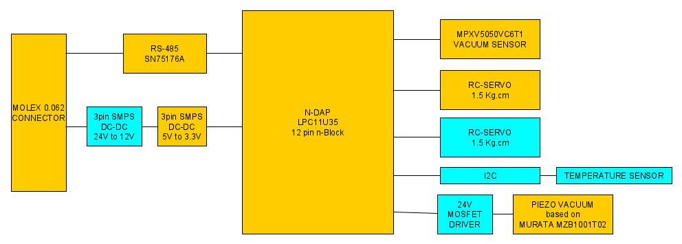

# n-DAP_MODBUS_FEEDER_ADC:  
##  Firmware for a PickPlace feeder control MODBUS board that controls an RC Servo and reads ADC   
## initial PROJECT at [mbed project](https://os.mbed.com/users/chalikias/code/n-DAP_MODBUS_FEEDER_ADC/) 
## current  PROJECT at [github project](https://github.com/nikoschalikias/firm_n-DAP_MODBUS_FEEDER_ADC) 


### Current operation:  
*  Does not respond to read ADC MODBUS commands  
*  Sends the ADC value only-once after RESET  
*  When a Modbus Byte is received:  
   * Resets INDEX (a byte-counter) when character 0x20 is received   
   * Responds by setting a PWM Output to [9th MODBUS byte] value, to drive an RC-Servo  
*  Does not check for the MODBUS FUNCTION '...details', only resets a BYTE-COUNTER when received (ADDRESS BYTE) 0x20 and THEN responds on the 9th Byte (2nd MODBUS DATA byte) content

## MODBUS message structure  
#### MODBUS FUNCTION send from MASTER for 'turn-on' or 'set_rc_Servo_Angle'  (partially implemented on slave)
```
00 ADDRESS         0x20  
01 FUNCTION        0x10   
02 REGISTER1       0x00    
03 REGISTER1       0x01   
04 NUMBERoFREGs    0x00  
05 NUMBERoFREGs    0x01  
06 NUMBER OF BYTES 0x00   
07 NUMBER OF BYTES 0x02   
08 DATA            0x00  
09 DATA            0x00  
10 CRC             Xxxx  
11 CRC             XxXX  
```

#### MODBUS COMMAND send from MASTER for 'read_pin' (not impemented yet on slave)
```
00 ADDRESS         0x20    
01 COMMAND         0x04    
02 LENGTH          0x03  
03 DATA            0x00  
04 DATA            0x00  
05 DATA            0x00  
06 CRC             XxXX  
07 CRC             XxXX 
``` 

#### This project was imported from mbed online compiler OS2 program as below

[More details in n-BlocksStudio mbed tips](https://www.n-blocks.net/nmodules/doku.php?id=nblocksstudio:installation#mbed_tips)