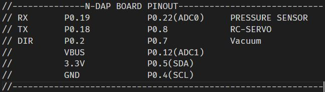

[](https://github.com/nikoschalikias) 
[](https://github.com/nikoschalikias/firm_n-DAP_MODBUS_FEEDER_ADC)
[]() 


* [tasks](tasks.md)

# n-DAP_MODBUS_FEEDER_ADC

Experimental MODbus-Instrument firmware, for a PickPlace machine


## Block Diagram


---

## Perforated Board Schematic


[n-DAP details](https://www.n-blocks.net/nmodules/doku.php?id=nblocks:n-pro-dap)

---

## Experimental setup


---


## n-DAP Board 'Text Art' Schematic




---

## N-PP

* Link: [N-PP](https://github.com/n-Modbus/N-PP) 
> * N-PP board, is a Modbus-Instrument Pick and Place Feeder control board, based on the 'perforated board' tested setup
>* N-PP status: assembled and ready for testing with firmware

<p align="center">

</p> 

`image 12: Board N-PP PCB 3D modeling`

----

## mbed compiler
  
* Initial program at [mbed program](https://os.mbed.com/users/chalikias/code/n-DAP_MODBUS_FEEDER_ADC/) 

* This project was imported from mbed online compiler OS2 program as below

[More mbed-cli tips at: n-BlocksStudio mbed tips](https://www.n-blocks.net/nmodules/doku.php?id=nblocksstudio:installation#mbed_tips)

* Current  project at [github project](https://github.com/nikoschalikias/firm_n-DAP_MODBUS_FEEDER_ADC) 

---

## Program performance   
*  Does not respond to read ADC MODBUS commands  
*  Sends the ADC value only-once after RESET  
*  When a Modbus Byte is received:  
   * Resets INDEX (a byte-counter) when character 0x20 is received   
   * Responds by setting a PWM Output to [9th MODBUS byte] value, to drive an RC-Servo  
*  Does not check for the MODBUS FUNCTION '...details', only resets a BYTE-COUNTER when received (ADDRESS BYTE) 0x20 and THEN responds on the 9th Byte (2nd MODBUS DATA byte) content

## MODBUS message structure 

* MODBUS FUNCTION send from Modbus-client for 'turn-on' or 'set_rc_Servo_Angle'  (partially implemented on Modbus-Instrument)
```
00 ADDRESS         0x20  
01 FUNCTION        0x10   
02 REGISTER1       0x00    
03 REGISTER1       0x01   
04 NUMBERoFREGs    0x00  
05 NUMBERoFREGs    0x01  
06 NUMBER OF BYTES 0x00   
07 NUMBER OF BYTES 0x02   
08 DATA            0x00  
09 DATA            0x00  
10 CRC             Xxxx  
11 CRC             XxXX  
```

*  MODBUS COMMAND send from Modbus-client for 'read_pin' (not impemented yet on Modbus-Instrument)
```
00 ADDRESS         0x20    
01 COMMAND         0x04    
02 LENGTH          0x03  
03 DATA            0x00  
04 DATA            0x00  
05 DATA            0x00  
06 CRC             XxXX  
07 CRC             XxXX 
``` 

